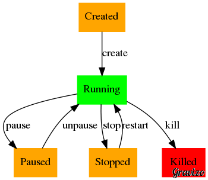

# Basic Docker commands

## Images and containers

* Images are just tar files, which are sets of other tar file. They are filesystem images. You can see which images you have with :
```bash
$ docker images
```

* Both images and containers have an UID in Hash64, AND a name which is a string
	* Images naming convention :
	  * Complete name is ```REPOSITORY:TAG```. Examples : 
	    * ```debian:wheezy```
	    * ```python:2.7```
	  * If no tag is supplied, Docker will use *latest*. Example : 
	    * ```dduportal/rpi-alpine``` is exactly the same than ```dduportal/rpi-alpine:latest```
	  * Images come from [Docker Hub](https://registry.hub.docker.com), unless you add the address of your own registry with a ```/``` separator. Examples : 
	    * ```registry.priv.org/my-app:latest```
	    * ```192.168.1.1:5000/arm-redis:0.3.0```
	  * You can use a namespace with a ```/``` separator before "REPOSITORY". Examples :
	    * ```ddupportal/arm-swarm:0.2.0```
	    * ```registry.priv.org/entity/my-jboss:latest```
	* Containers naming : [See that class :)](https://github.com/docker/docker/blob/master/pkg/namesgenerator/names-generator.go)

* Get new images with :
```bash
$ docker pull IMAGENAME
```

Test by replacing IMAGENAME by ```dduportal/rpi-alpine:edge```

* Containers are the running entities that start from images. You can see which containers are (or have been) running on your system with :
```bash
$ docker ps # -a for all
```

* You can inspect images AND containers metadatas, providing UID or name to this unique command. :
```bash
$ docker inspect UID/or/NAME
```

Test by replacing UID/or/NAME by ```dduportal/rpi-alpine:edge```

## Running containers

* We can have 3 differents type of container runs (from an image) :
  - "One shot" running : run a single command and then exit :

    ```
	$ docker run dduportal/rpi-alpine echo 'Hello World !'
	```
  - "Interactive" : spawn a container and run a shell interactively inside :

  
    ```
	$ docker run -ti dduportal/rpi-alpine /bin/sh
	```
  - "Daemon" : launch a container in background :

  
    ```
	$ docker run -d dduportal/arm-nginx /some/command -in background
	```

* A container only have one command which is a simple Linux process. It can be specified at runtime or thru the images metadatas (default command) :
```bash
$ docker run -d dduportal/arm-redis:3.0.0
```

* Once a container hs been launched in background, you can spawn another process inside if you want to do some introspections tasks :
```bash
$ docker run --name webserver -d dduportal/arm-nginx
...
$ docker exec -ti webserver /bin/sh
bash-4.3 # ps aux | grep nginx
...
```

* Containers lifecycle : See below the all lifecycle, implying Docker's sub-commands like ```start```, ```create```, etc. 



## Containers network

* Default behaviour of Docker is to create a network stack for each container, and connect them to a virtual network. Access is done thru the host's interface named _docker0_ :


* By default, you can access your container from the host or another local cotnainer, using the container's direct IP :
```bash
$ docker run -d --name webserver dduportal/arm-nginx:latest
...
$ docker inspect --format '{{ .NetworkSettings.IPAddress }}' webserver
172.17.0.15
$ curl -I --no-proxy='*' http://172.17.0.15
...
```

* Which port to use ? Seach for "Expose" in
```bash
$ docker inspect dduportal/arm-nginx
...

* If you want to give external access to your container, the preferred way is to use port forwarding :
  - 1st strategy is letting Docker select the port(s) to use :

    ```bash
    $ docker run --name=webserver -d -P dduportal/arm-nginx
    ...
    $ docker port webserver
    80/tcp -> 0.0.0.0:PORT
    443/tcp -> 0.0.0.0:PORT2
    $ curl -I http://127.0.0.1:PORT
    ...
    ```

  - 2nd is to specify the port (and the interface, and/or the level 3 protocol) to bind the forwarding to :

    ```bash
    $ docker run --name=webserver -d -p 10000:80 dduportal/arm-nginx
    ...
    $ docker port webserver
    80/tcp -> 10.0.2.15:10080
    $ curl -I http://10.0.2.15:10080
    ...
    ```

* Anyway, [they are other networking configurations](https://docs.docker.com/reference/run/#network-settings), it's moving [a lot those times](http://socketplane.io/blog/socketplane-excited-to-be-joining-docker-to-collaborate-with-networking-ecosystem/) :
  - Start a container on your host's network stack : 

    ```bash
    $ docker run --net=host ...
    ```
  - Start a container on another container's network stack : 

    ```bash
    $ docker run --net= container:ANOTHER_CONTAINER_ID ...
    ```
  - Start a container with no network : 

    ```bash
    $ docker run --net=none ...
    ```
  - Add custom DNS (host's ones will be use as fallback) : 

    ```bash
    $ docker run --dns 8.8.8.8 ...
    ```

* One powerful network functionnality of Docker is the "Containers linking". it allows 2 containers to know each others thru local DNS naming and environment variables :
```bash
$ docker run -d --name redissrv dduportal/arm-redis:3.0.0
...
$ docker run -ti --link redissrv:dbserver dduportal/arm-redis:3.0.0 env
# <Have a look to this content>
...
$ docker run -ti --link redissrv:dbserver dduportal/arm-redis:3.0.0 \
  redis-cli -h dbserver -p 6378
...

```

* Practical example : **The Redis Token Ring** . Connect a local redis-client to the redis server of your left neighbour.

## Build you own images

* Docker use a "copy-on-write" underlying filesystem. Everything written inside a container is just a set of data blocks, virtualized as a "Linux Filesystem". We're talking about a stack of layers :


```bash
$ docker images --tree
├─a8adec1c8256 Virtual Size: 4.93 MB Tags: dduportal/rpi-alpine:edge, dduportal/rpi-alpine:latest
│ ├─d0fbd61239a1 Virtual Size: 4.931 MB
│ │ └─f9774afcfa3c Virtual Size: 4.931 MB
│ │   └─80bd603c6503 Virtual Size: 50.78 MB
│ │     └─f4937bd913df Virtual Size: 56.93 MB
│ │       └─e5319849a634 Virtual Size: 56.93 MB Tags: composetest_web:latest

```

* Manually create an image - **This is bad practise** :
  1. run a container

    ```bash
    $ docker run -ti dduportal/rpi-alpine sh
    ```

  2. write something inside and terminate that container

    ```bash
    sh # echo "Hello" > /file.txt
    sh # exit
    $
    ```

  3. commit that container to create a new image (== a new set of layers)

    ```bash
    $ docker commit -m "Image with a new text file" JUST_TERMINATED_CONTAINER_ID myimage:1.0.0
    ```

  5. Run a new container based on the newly created image

    ```bash
    $ docker run myimage:1.0.0 cat /file.txt
    Hello
    $
    ```

* Automatize the image creation with a ```Dockerfile``` :

```bash
$ cat Dockerfile
FROM dduportal/rpi-alpine:edge
MAINTAINER your name here

RUN echo "Hello" > /another_file.txt
$ docker build -t myimage:2.0.0 ./
...
$ docker run myimage:2.0.0 cat /another_file.txt
Hello
```

* You can re-tag and push your images to registry - **AGAIN : bad practise ALERT**
```bash
$ docker tag myimage:2.0.0 myusername/myimage:2.0.0
...
$ docker push myusername/myimage:2.0.0
...
```

* **Good practises for building images**
  - Think of testing you images BEFORE building it (What's inside ? What's the wanted behaviour ?)
  - Implement testing with automated tools : [bats](https://github.com/sstephenson/bats), [serverspec](http://serverspec.org/), [cucumber with aruba](https://github.com/cucumber/aruba), etc.
  - Use the [automated builds of Docker Hub](https://docs.docker.com/docker-hub/builds/) : your user have to knwo what's inside your images
  - Be careful with the size of your images : [optimize](http://www.centurylinklabs.com/optimizing-docker-images/) and [squash](http://jasonwilder.com/blog/2014/08/19/squashing-docker-images/)
  - Use Continous Integration : [DockerHub with automated builds](https://docs.docker.com/docker-hub/builds/), [CircleCi](https://circleci.com/), [TravisCI](https://travis-ci.org/), [Jenkins](https://wiki.jenkins-ci.org/display/JENKINS/Docker+Plugin), etc.

## Playing with data volumes

* Copy-on-write is UBER cool for building and sharing images. But it's will destroy your I/Os when doing a lot writes : logs, tmp dirs, database storage dirs...

* There is a solution for that : [Docker's volumes](https://docs.docker.com/userguide/dockervolumes/). Tell Docker which path of your container are going to be "data volumes" :
  - At image level : with the ```VOLUME``` instruction in the Dockerfile :

     ```
     $ cat Dockerfile
     FROM dduportal/rpi-alpine:edge
     ...
     VOLUME ["/var/log","/var/lib/mysql"]
     ``` 
  - At run time : with the ```-v``` switch of docker run command :

    ```bash
    $ docker run -v /app dduportal/rpi-alpine:edge /bin/sh
    ```

* A "volume" is a folder or a file which is "bind-mounted" from the host inside the container. So it:
  - Won't be tracked down by the "copy-on-write" union filesystem
  - Won't be shared thru commit / build / images
  - Will have "host-native" I/Os performances
  - Its lifecyle and content will be bound to the Host : your host goes down, your data too ! **Do not forget backup and sync. systems**

* You can reach volume's content from your host :
```bash
$ docker run --name data-test -v /app dduportal/rpi-alpine:edge touch /app/file.txt
$ docker inspect --format '{{ .Volumes }}' data-test
map[/app:/mnt/sda2/var/lib/docker/vfs/dir/57b67b6f493a67daa1c617b4412a29a6e013833344b6e11139a0055014a797f1]
$ sudo ls -l /mnt/sda2/var/lib/docker/vfs/dir/57b67b6f493a67daa1c617b4412a29a6e013833344b6e11139a0055014a797f1
total 0
-rw-r--r--    1 root     root             0 May  6 11:56 file.txt
```

* You can share data beetween containers with **no overhead** :
```bash
$ docker run --volumes-from data-test dduportal/rpi-alpine:edge ls -l /app
total 0
-rw-r--r--    1 root     root             0 May  6 11:56 file.txt
```

* You can share data from your host to your containers :
```bash
$ ls /DATAS
dir1  dir2  file1 file2 file3
$ docker run -v /DATAS:/app dduportal/rpi-alpine:edge ls /app
dir1  dir2  file1 file2 file3
``` 

* The "Data container" : a one-shot container, just have to exists, don't need to run, see that like a "filer" :
```bash
$ docker run --name data -v /var/lib/mysql -v /var/log -v /var/www dduportal/rpi-alpine:edge true
$ docker run --volumes-from data -d mysql:latest
$ docker run --volumes-from data -d apache:latest
```

## Advanced Docker

### Cleaning

* Since a stopped container will still exists as a file system image and metadatas, you can delete them :
```bash
$ docker rm my_container
```

* If your container had data volumes associated, consider deleting them. Note that it will just unreference the container from the volume's metadatas if another container are using this volume.
```bash
$ docker run -v data-container
```

* Use the ```--rm``` switch with docker run with "one-shot" containers to auto-delete them after when it'll stop :
```bash
$ docker run --rm dduportal/rpi-alpine:edge echo "Hello"
```

* You can also delete images if no containers remains referencing it. Note that it will just untag if another tag refers to the same image :
$ docker images
my_app  1.0.0   ID1 ...
my_app  2.0.0   ID2 ...
my_app  latest  ID2 ...
$ docker rmi my_app:1.0.0 my_app:2.0.0
$ docker images
my_app  latest  ID2 ...
```

* Terminators commands :
  - Delete all containers existing on the host. (Running one will be ignored) :

    ```bash
    $ docker ps -a -q | xargs docker rm -v
    ```

  - Delete all images (referenced one won't be) :

    ```bash
    $ docker images -q | xargs docker rmi
    ```

### Logging

* Each container's stdout will be written in a log file on the host level :
```bash
$ docker run -d dduportal/rpi-alpine:edge echo ok
$ sudo cat /var/lib/docker/<CONT_ID>/log.json
```

* There is docker command for that :
```bash
$ docker run -d --name dbserver redis
$ docker logs (-f) dbserver
```

* This is the default behaviour but you can, since 1.6.0 you also can use :
  - "no-logging" mode : better I/Os
  - "syslog" driver, to log in a rsyslog collector
  - more to come : plugin driver architecture. Write your own !

### Client / server

* Docker is "just" an HTTP server. It has a client and a server, communicating thru sockets (Unix and/or TCP), using the HTTP protocol at level 7. Note that the binary can act as client and server.

* Given that the docker engine server expose a complete REST API, you can request it with any HTTP clien, and easily use docker client in java/python/go/ruby/etc.

* You can manage a remote docker daemon, in remote servers, with a local client :
```bash
$ docker ps
...
$ docker -H tcp://ANOTHERIP:2375 ps
...
```

* Default configuration :
  - Locally, client and server dial thru the 

### WTF ?

* Inception !
```bash
$ which docker
/usr/local/bin/docker
$ docker run -v $(which docker):$(which docker) -v /var/run/docker.sock:/var/run/docker.sock dduportal/rpi-alpine:edge docker ps
...
```
