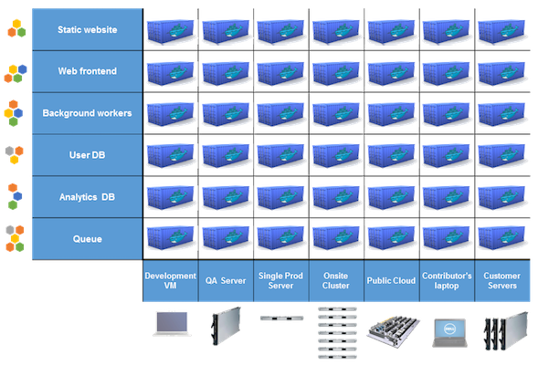

title: Learn Docker on Raspberry Pi
name: inverse
layout: true
class: center, middle, inverse
---
# Learn Docker on Raspberry Pi

---
layout:false

# Agenda :

1. Docker ?
2. Prepare your Pi
3. Docker Basics
4. Docker compose
5. (Maybe) Docker swarm

---
template: inverse

# Docker ?

---

layout: false
.left-column[
# Docker ?
  ## What's the problem ?
]
.right-column[

# Matrix of Hell

.center[]

]
