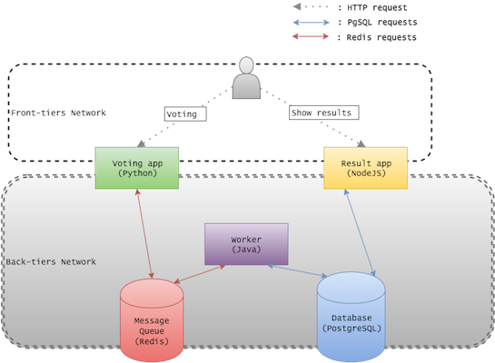
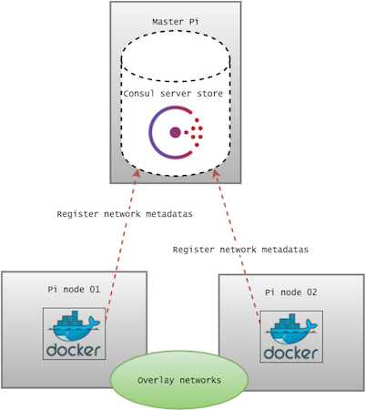

class: center, middle

# Docker-Bel Meetup
## Swarm on Raspberry Pis

---

# Agenda

* 19h: Welcome & bootstrap
* 19h30: Talk from Dieter Reuter from Hypriot
* 20h: Workshop time !
* 22h: End of the workshop + drinks and snacks

---

# Welcome to the meetup !
## How to quickly bootstrap ?

1. Connect your laptop to the shared Wifi "Dadou’s MacBook Air" (dockerbel)

2. Insert the SD card (previously flashed), connect the Pi to Ethernet and
power it with micro-USB

3. Come at the "shack" to tell us which hostname you want to use. Be creative !

4. After we have configured your hostname, ssh to your host :
  ```
  $ ssh root@<your hostname>.local # Password is hypriot
  ```

5. Upgrade embedded docker tools :
  ```
  $ apt-get update && apt-get install --only-upgrade docker-hypriot docker-compose
  ```

---

class: center, middle

# Welcome Dieter Reuter from Hypriot
### Talk time !


---

# Now let's workshop !
## Goal :

* We want to launch the Docker demo "voting app" on a cluster of Raspberry Pis.
  - Docker on ARM board ? Voting app ?

* This voting app will be launched on Swarm cluster.
  - How to bootstrap Swarm ?

* Workshop logistic : we'll group by 3 boards : 1 master, 2 nodes
  - Meet, Talk and Work together !

---

# Now let's workshop !
[Docker Voting app](https://github.com/docker/example-voting-app)



---

# Now let's workshop !
## ARM board ? Which image ?

HypriotOS helps us to run Docker : easy !
```
$ docker -v
Docker version 1.10.0, build 590d5108
```

but which image to run ?

```
$ docker run -ti --rm alpine:latest sh
exec format error
```

You have 2 good starting points :
```
$ docker run -ti --rm hypriot/rpi-alpine-scratch echo "Lightweight ARM image"
Lightweight ARM image

$ docker run -ti --rm resin/rpi-raspbian echo "Complete ARM image"
Complete ARM image
```

---

# Now let's workshop !
## ARM Voting App : mastering docker-compose

We made your life easy : an ARM voting app ready to go !

```
git clone https://github.com/jmMeessen/rpi-voting-app
```

* A generic `docker-compose.yml` using the DockerHub

* Extended by `dev-compose.yml` that will build images from sources

* Another extending with `workshop.yml` that will use a local private registry

---

# Now let's workshop !
## Target Physical architecture :


---

# Now let's workshop !
## Step 1 : Master configuration

We need a Key-Value Store with discovering abilities. We'll use **consul**.
(Alternatives : etcd, zooKeeper).

2 types of data will be stored :
* Docker virtual networks (from Docker engines)
* Swarm nodes (from Swarm agent)

Start consul on your master Pi (using docker for convenience) :
```
$ docker run -d --net=host --restart=always --name=consul hypriot/rpi-consul \
  agent -dev -ui -ui-dir=/ui -advertise=<Master IP> -bind=<Master IP> \
  -client=<Master IP>
$ docker logs consul
```

GUI is available at `http://<Master IP>:8500`

---

# Now let's workshop !
## Step 1 : Nodes docker engines configurations

On each of your **nodes** :

* Add those items to the line with **DOCKER_OPTS** in `/etc/default/docker` :
  - Insecure access to the local shack private registry used for caching :
  ```
  --insecure-registry 192.168.2.1:5000
  ```
  * Daemon listening to HTTP (needed for remote docker commands) :
  ```
  -H tcp://0.0.0.0:2375
  ```
  * Configure the multi-host network capability :
  ```
  --cluster-store consul://<PI MASTER IP>:8500 --cluster-advertise=eth0:2375
  ```
* Restart docker : `systemctl restart docker`
* Check with `docker info` and `ps aux | grep docker`

---

# Step 1 : State of the infrastructure



---

# Now let's workshop !
## Step 2 : Start Swarm - agents

We need to start by launching "Swarm agents" on each node.

Their goals will be :
* Register to consul as "Swarm nodes"
* Regularly report their good health to consul

The commands (use an image locally stored) to run on **each** node :

```
$ export MY_IP=$(ip addr|awk '/eth0/ && /inet/ {gsub(/\/[0-9][0-9]/,""); print $2}')

$ docker run -d --restart=always --name=swarm-agent 192.168.2.1:5000/swarm \
  join -advertise ${MY_IP}:2375 consul://<MASTER IP>:8500

$ docker logs -f swarm-agent
```

---

# Now let's workshop !
## Step 2 : Start Swarm - master

Now, time to launch the master.

Its goals will be :
* Provide an HTTP Docker API that will serve as Proxy for your docker commands
* Retrieve and regularly update a list of Docker remote nodes
* Orchestrate the docker commands it will receive

The commands (use an image locally stored) to run on the master Pi :
```
$ docker run -d -p 10000:6000 192.168.2.1:5000/swarm manage \
  -H 0.0.0.0:6000 consul://<MASTER PI IP>:8500
```

---

# Step 2 : State of the infrastructure


---

# Now let's workshop !
## Step 2 : a bit of testing

* Test the Swarm cluster from your laptop (read carefully) :
```
$ export DOCKER_HOST=tcp://<MASTER PI IP>:10000
$ docker info
...
```
* Create an overlay network across the swarm cluster :
```
$ docker network ls
...
$ docker network create --driver=overlay test-net-01
...
$ docker network ls
...
```

---

# Now let's workshop !
## Step 3 : Docker compose

* From your laptop, you need docker-compose >= 1.6.0
(https://docs.docker.com/compose/install/)

* Git clone / download this repository :
https://github.com/jmMeessen/rpi-voting-app

* Launch the voting-app using the "private registry" settings :
```
$ cd vote-apps
$ docker-compose -f meetup.yml up
```

* Then check logs and test on 5000 and 5001 ports !
